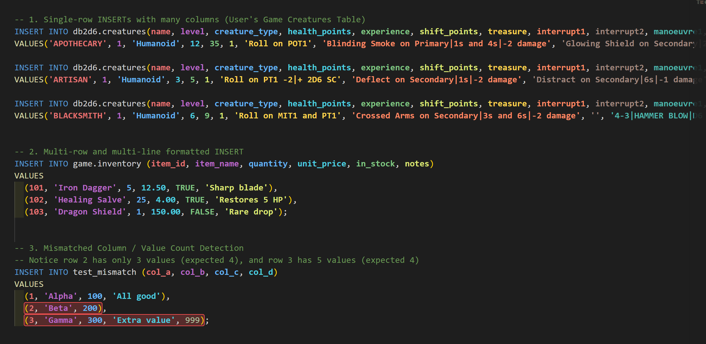
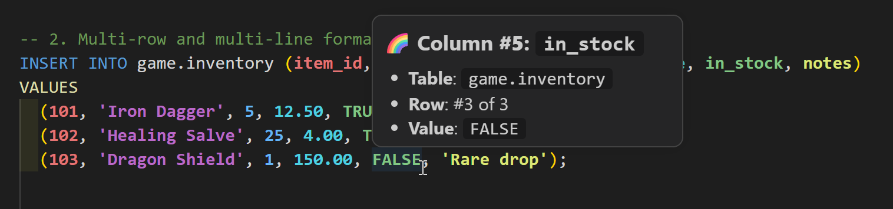
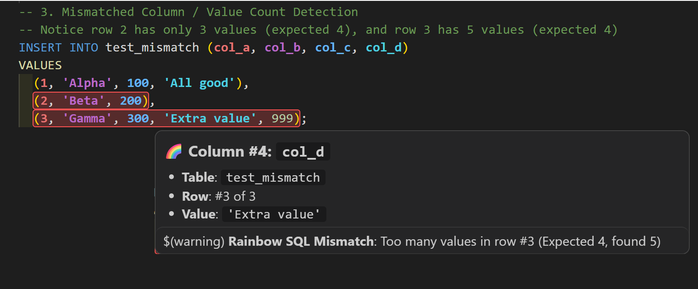

# Rainbow SQL

<p align="center">
  
</p>

Rainbow SQL makes SQL `INSERT` statements easier to read by coloring each column and its corresponding values consistently. It also helps you inspect columns and spot rows with a mismatched number of values.

## Screenshots



### Hover details

Hover over a value to see its column number, name, table, and row position.



### Mismatched column / value count detection

Rows whose value count differs from the declared columns are highlighted.



## Features

- **Matching column and value colors**:  follow each declared column through one or more `VALUES` rows.
- **Single-row and multi-row statements**:  supports statements laid out on one line or across multiple lines.
- **Column details on hover**:  inspect the column number, name, table, and row position.
- **Active column in the status bar**:  see the current column while moving through a statement.
- **Mismatch detection**:  identify rows whose value count differs from the declared column count.
- **Theme-aware colors**:  separate palettes for light and dark themes, with customizable colors.
- **SQL-aware parsing**:  handles quoted values, comments, nested expressions, and common identifier quoting styles.

For example, the values are colored to match their corresponding columns:

```sql
INSERT INTO items (id, code, price)
VALUES
  (101, 'ITEM_A', 19.99),
  (102, 'ITEM_B', 24.50);
```

## Supported SQL languages

The extension activates for SQL, PostgreSQL, MySQL, PL/SQL, T-SQL, and SQLite language modes.

## Extension settings

| Setting | Type | Default | Description |
|---|---|---|---|
| `rainbowSql.enabled` | `boolean` | `true` | Enable or disable column highlighting. |
| `rainbowSql.enableHover` | `boolean` | `true` | Show column details when hovering over values. |
| `rainbowSql.enableStatusBar` | `boolean` | `true` | Show the active column in the status bar. |
| `rainbowSql.highlightMismatches` | `boolean` | `true` | Highlight rows with a different number of values than declared columns. |
| `rainbowSql.darkColors` | `string[]` | 10 colors | Color palette used with dark themes. |
| `rainbowSql.lightColors` | `string[]` | 10 colors | Color palette used with light themes. |

Configure these options in VS Code Settings by searching for **Rainbow SQL**.

## Command

Run **Rainbow SQL: Toggle Rainbow SQL Highlighting** from the Command Palette to turn highlighting on or off.

## Questions and issues

If you have a question, find a problem, or would like to suggest an improvement, [open an issue on GitHub](https://github.com/fboucher/vscode-rainbow-sql/issues). For bug reports, include your VS Code version and a small SQL example that demonstrates the issue.

## Development

To run the extension from this repository:

1. Open the repository in VS Code.
2. Press `F5` to launch the Extension Development Host.
3. Open `sample.sql` in the new window.

Run the automated tests with:

```bash
npm test
```
